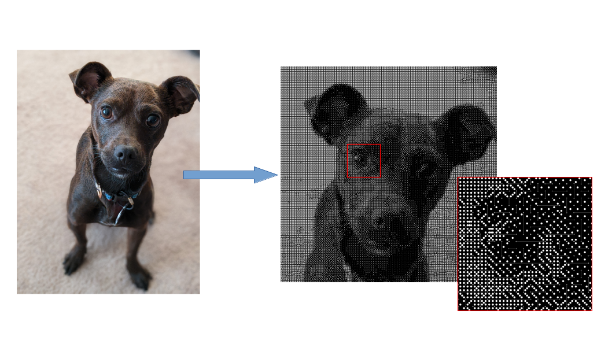

# Dominoes

Find the optimal arrangement of a set of dominoes to represent an image. Uses a linear program to determine the placement and orientation of the dominoes. All dominoes are contained within the bounds of the image.

1. Use the notebook in image/ to get the relative brightness of each square in the image on a scale of 0-9.
2. Find the optimal solution to the dominoes problem with optim/dominoes.cpp
3. Use the notebook in solution/ to plot the solution and write out the final png image

The tiles/ directory also contains a notebook to generate a png image for each individual tile. These are then arranged in the final solution to generate the image
